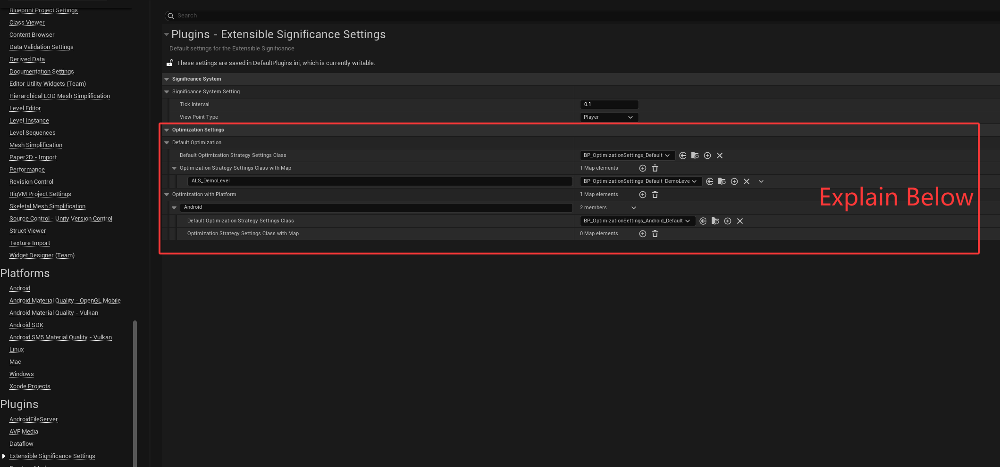

An out-of-the-box significance system with easy extensibility for custom optimization strategies。

You Need:

1.Add these configs in DefaultEngine.ini, In your project.

[/Script/SignificanceManager.SignificanceManager]
SignificanceManagerClassName=/Script/ExtensibleSignificanceSystem.ExtensibleSignificanceManager

2.Inherit USignificanceOptimizationStrategySettings classes to configure your own optimization strategies

3.ProjectSettings->Extensible Significance Settings Set your optimization strategies classes

Explain:

 3.1 DefaultOptimization: Default optimization strategy settings. If the current platform does not set a specific optimization strategy, that is, the following OptimizationWithPlatform does not configure the optimization strategy of the corresponding platform. Then this field will take effect.

   3.1.1 DefaultOptimizationStrategySettingsClass: The default optimization strategy configuration under the current platform, if there is no optimization strategy for a specific map, that is, the following OptimizationStrategySettingsClassWithMap does not configure the optimization strategy for the corresponding map, then this field will take effect.

   3.1.2 OptimizationStrategySettingsClassWithMap: Optimization strategy configuration of a specific map under the current platform, key: Map name, value: USignificanceOptimizationStrategySettings subclass, optional, no specific requirements can not be matched.

 3.2 OptimizationWithPlatform: Optimization strategy under a specific platform, Key: represents the corresponding platform name, for example, Android, IOS, Windows, etc. value: structure is the same as DefaultOptimization

You can inherit USignificanceCalculateStrategyBase class to implement your own Significance calculation strategy. And inherit UExtensibleOptimizationStrategyBase class to implement your own optimization strategies. It's very scalable.
